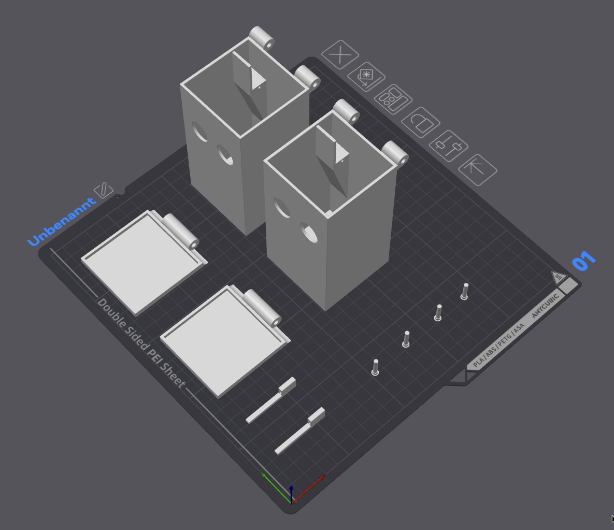

# 🥫 PiCan – Touchless Smart Trash Can with Raspberry Pi

# 🇬🇧 **This Description starts in English — Deutsche Version weiter unten ** 🇩🇪 #

---

## 🇬🇧 English Description

**PiCan** turns the trash can into a smart, touchless bin powered by a **Raspberry Pi** OR **ESP32**.  
It uses an **HC-SR04 ultrasonic sensor** and a **SG90 servo motor** to automatically open the lid when your hand approaches — and close it again after a short adjustable delay.

This project is ideal for **IT enthusiasts, students, and teachers** who want to explore **Python programming, GPIO control, and sensor integration** in a real-world project.
Benefit: You can print the complete can with a 3D printer ;-)

**My advice? Build it step by step.**
Start with just the servo and get it working properly. Once that’s solid, move on to the ultrasonic sensor – all by itself.
And seriously: look up how both components actually work!
If you understand what’s going on, you’re not just copying — you’re creating.
So yeah: Don’t just build it. Own it. ⚡️

---

### 🚀 Features
- Touchless lid opening via ultrasonic distance detection  
- Adjustable trigger distance (default: 9 cm)  
- fast servo movement with SG90
- Clean, minimal Python code – perfect for learning GPIO  
- Works on any Raspberry Pi model

- You will also find Arduino Code for ESP32

---

### 🧰 Hardware Requirements
- Raspberry Pi (any model with GPIO) **recommended Raspberry PI 3b or better**
- HC-SR04 ultrasonic distance sensor
- SG90 or MG90S servo motor
- Jumper wires and breadboard
- 5 V power supply
- 1 kΩ + 2 kΩ (or 3x 1kΩ) kresistors for voltage divider for the output signal form HC-SR04 !! (strongly recommended to avoid damage to the Raspberry)

---

### ⚙️ Wiring Overview

|  Component   | Raspberry Pi Pin | BCM     | Note                      |
|--------------|------------------|---------|---------------------------|
| HC-SR04 VCC  | Pin 2 (5 V)      | –       | Power                     |
| HC-SR04 GND  | Pin 6 (GND)      | –       | Ground                    |
| HC-SR04 TRIG | Pin 16           | GPIO 23 | Output                    |
| HC-SR04 ECHO | Pin 18           | GPIO 24 | Input via voltage divider |
| Servo Signal | Pin 12           | GPIO 18 | PWM output                |
| Servo VCC    | Pin 4 (5 V)      | –       | Power                     |
| Servo GND    | Pin 9 (GND)      | –       | Ground                    |

---

### 🧠 Working principle ###

The operation of an SG90 servo is based on a PWM signal with 50 Hz, meaning the servo receives a control pulse every 20 ms via the data line from the Raspberry Pi.
Depending on the pulse width (duration of the HIGH signal), the servo moves from its initial position (0°) to its maximum deflection (typically around 160–180°).

- A pulse width of approximately 1 ms corresponds to 0°,
- while a pulse width of around 2 ms corresponds to 180°.
- Due to mechanical design limits, many servos do not reach the full 180° range and instead stop at about 160°.

Since each servo can vary slightly, the exact timing values should be determined experimentally, by carefully testing and adjusting the pulse width until the movement range fits correctly.

---

**Voltage divider:**  
Use 1 kΩ (top) + 2 kΩ (bottom) resistors on the ECHO line to safely reduce 5 V to ~3.3 V.
Don´t foget it! The Raspberry Port or SOC will damage - not instead but after a longer time!!!
---

### 💻 Software Setup

Normally the needed modul python3-rpi.gpio is already pre-installed on every raspberry pi os.

---

### 💻 Author ###

Marco Kister
IT Trainer & Maker
marco-itech.de
TikTok @marco_itech
hallo@marco_itech.de

--------
--------

## 🇩🇪 Deutsche Beschreibung 🇩🇪 ##

PiCan verwandelt jeden Mülleimer in einen intelligenten, berührungslosen Abfalleimer auf Basis eines Raspberry Pi.
Ein HC-SR04-Ultraschallsensor und ein Servomotor öffnen automatisch den Deckel, sobald sich eine Hand nähert – und schließen ihn nach einer von euch einstellbaren Zeit wieder.

Dieses Projekt eignet sich perfekt für IT-Begeisterte, Schüler, Studierende und Lehrkräfte, die Python-Programmierung, GPIO-Steuerung und Sensor-Integration praxisnah kennenlernen oder vermitteln möchten.

**Ich würde dir echt empfehlen, das Ganze Schritt für Schritt aufzubauen.**
Starte nur mit dem Servo und bring den erst mal sauber zum Laufen. Wenn der geht, kommt der Ultraschallsensor dran – auch erst einmal einzeln.
Und hey: Recherchier unbedingt, wie die beiden Teile wirklich funktionieren!
Nur wer versteht, was er da macht, kann später richtig coole Dinge bauen.
Also: Nicht nur nachbauen – kapieren und abliefern! 💪

---

### 🚀 Funktionen ###

- Automatische Deckelöffnung durch Abstandserkennung
- Einstellbarer Auslöseabstand (Voreingestellt: ca. 9 cm)
- schnelle Servo-Bewegung
- Einfacher Python-Code, ideal für Lernzwecke und eigene Erweiterungen
- Funktioniert auf allen Raspberry-Pi-Modellen (ich empfehle den 3B und höher ;-) )

---

### 🧰 Benötigte Hardware ###

- Raspberry Pi (beliebiges Modell mit GPIO)
- HC-SR04-Ultraschallsensor
- SG90 Servomotor oder vergleichbar
- Jumperkabel und Breadboard
- 5-V-Netzteil
- Spannungsteiler mit 1 kΩ + 2 kΩ (oder 3 Stück 1kΩ) Widerständen (dringen empfohlen um das Ausgangssignal vom Ultra-Schallsenser von 5V auf den soll Wert 3.3V für die GPIO Pins zu reduzieren!!!)

Hintergrund ist, dass die GPIO Pins 3.3 V ausgeben und auch maximal 3.3 V als Eingang erwarten. Höhere Spannungen werden über eine Diode abgeleitet die dadurch auf Dauer aber überhitzt und nicht sofort aber über länger/kürzer ein Defekt an dem GPIO Controller oder SOC auftreten könnte, was den Raspberry PI dann unbrauchbar macht oder ganz zerstört. NICHT VERGESSEN!

---

### Verdrahtung ###

|  Component   | Raspberry Pi Pin | BCM     | Note                                         |
|--------------|------------------|---------|----------------------------------------------|
| HC-SR04 VCC  | Pin 2 (5 V)      | –       | Stromversorugung                             |
| HC-SR04 GND  | Pin 6 (GND)      | –       | GND                                          |
| HC-SR04 TRIG | Pin 16           | GPIO 23 | Output                                       |
| HC-SR04 ECHO | Pin 18           | GPIO 24 | EINGANG und Spannungsteiler nicht vergessen! |
| Servo Signal | Pin 12           | GPIO 18 | PWM Ausgang                                  |
| Servo VCC    | Pin 4 (5 V)      | –       | Stromversorgung                              |
| Servo GND    | Pin 9 (GND)      | –       | GND                                          |

---

### 🧠 Funktionsweise ###

- Der Ultraschallsensor misst fortlaufend den Abstand.
- Wenn sich ein Objekt (z. B. eine Hand) innerhalb des definierten Abstands befindet, aktiviert der Pi den Servo.
- Der Deckel öffnet sich automatisch und schließt sich nach kurzer Zeit wieder.

Die Funktionsweise eines Servo SG90 basiert auf einem PWM-Signal mit 50 Hz, das heißt, der Servo erhält alle 20 ms ein Steuersignal über das Datenkabel vom Raspberry Pi.
Je nach Pulsbreite (Dauer des HIGH-Signals) bewegt sich der Servo ausgehend von seiner Grundposition (0°) bis zu seiner maximalen Auslenkung (typisch etwa 160–180°).

- Eine Pulsbreite von ca. 1 ms entspricht dabei der 0°-Position,
- eine Pulsbreite von ca. 2 ms etwa 180°.
- Bauartbedingt erreichen viele Servos den vollen Bereich jedoch nicht vollständig und enden oft schon bei rund 160°.

Da jeder Servo leichte Abweichungen aufweist, sollte man die genauen Werte experimentell ermitteln und sich durch vorsichtiges Testen an die passenden Signalzeiten herantasten.

---

### 🧩 Einsatzbeispiele ###

Ideal für:
- IT-Unterricht und Ausbildung
- Schul- oder Studienprojekte
- Maker- & DIY-Projekte

---

### 💻 Author ###

Marco Kister
IT Trainer & Maker
marco-itech.de
TikTok @marco_itech
hallo@marco_itech.de
